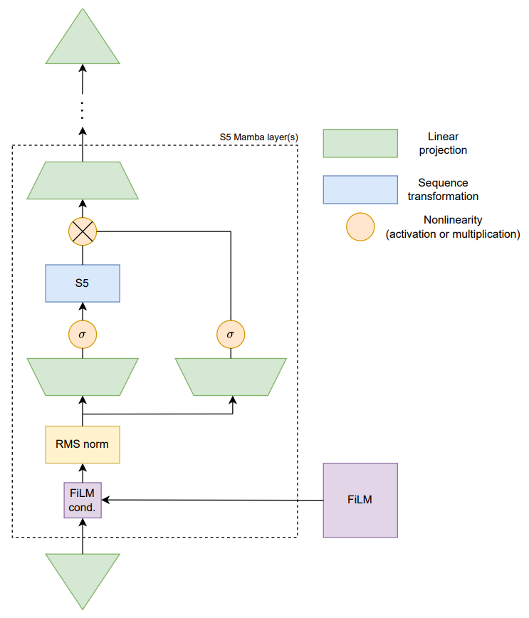
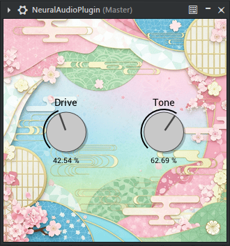

# Mamba S5 audio plugin
A real-time audio plugin using the [Mamba](https://arxiv.org/abs/2312.00752) architecture combined with the [S5](https://arxiv.org/abs/2208.04933) SSM.

## Model architecture

## Plugin interface

## How to run
### neural_network folder
1. Install requirements in requirements.txt
2. Download a dataset and preprocess it.
3. Run train.py and eval.ipynb.
4. Create model_weights.h.
<pre><code>xxd -i model_weights.json > model_weights.h</code></pre>
5. Edit model_weights.h.
<pre><code>#ifndef MODEL_WEIGHTS_H
#define MODEL_WEIGHTS_H

unsigned char model_weights_json[] = {...};
unsigned int model_weights_json_len = ...;

#endif</code></pre>
### plugin folder
6. Copy model_weights.h to NeuralAudioPlugin folder.
7. Build plugin (tested with Visual Studio 2022).

## Info
The neural_network folder includes the PyTorch model. The model is sample rate agnostic: a model trained using 48 kHz works as well at 44.1 kHz. The model is trained with TBPTT and p_zero (5%) percentage of training samples are randomly zeroed with random conditioning to combat crackling sounds in the C++ implemention during knob changes.

The plugin folder includes the [IPlug2](https://github.com/iPlug2/iPlug2) plugin. The model is implemented using [XSimd](https://github.com/xtensor-stack/xsimd) for faster inference. The plugin is real-time capable, albeit expensive with ~20% CPU utilization with an Intel i5-12400f. Training a smaller model to sacrifice fidelity is possible.
